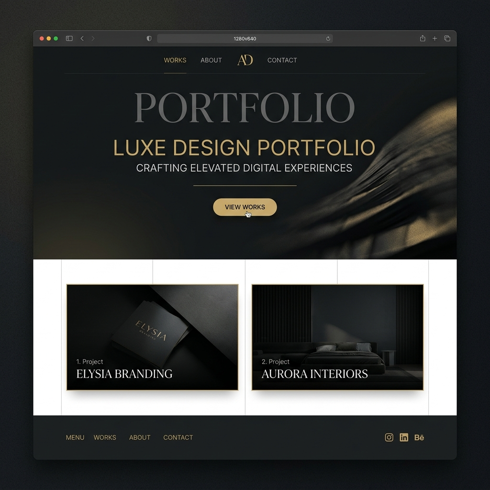

# Portfolio Website



A high-fidelity, cinematic professional portfolio built with **React**, **Vite**, **Framer Motion**, and **Three.js**.

## 🌟 Features

- **Cinematic Experience**: Immersive dark-mode design with fluid animations.
- **Motion System**: Scroll-driven parallax effects and staggered reveal animations.
- **Admin Dashboard**: Real-time content management without a backend.
- **Responsive Layout**: Optimized for all devices from mobile to ultra-wide displays.
- **Internationalization**: Support for multiple languages.

## 🚀 Getting Started

### Prerequisites

- Node.js (v18+)
- npm or yarn

### Installation

1. Clone the repository:
   ```bash
   git clone https://github.com/abidsaif697-sketch/Portfolio-Website.git
   ```
2. Install dependencies:
   ```bash
   npm install
   ```
3. Start the development server:
   ```bash
   npm run dev
   ```

## 🛠️ Tech Stack

- **Framework**: [React](https://react.dev/)
- **Build Tool**: [Vite](https://vitejs.dev/)
- **Animations**: [Framer Motion](https://www.framer.com/motion/)
- **3D/Graphics**: [Three.js](https://threejs.org/)
- **Styling**: Vanilla CSS

## 📄 License

This project is licensed under the MIT License.
